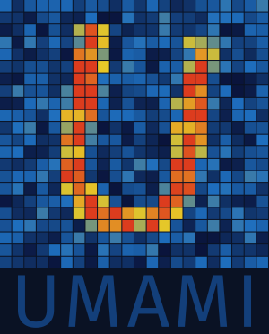

<p align="center">
  
</p>

# Unified Mechanism for Acquisition of Measured Intensity (UMAMI)

UMAMI is a data acquisition backend for neutron detectors. It implements a
"modular pipeline" approach which combines detector-specific backends with
configurable processing steps.

## How it works

One UMAMI process is configured by a config file that configures and starts
several components (many in separate threads) that act as a data pipeline:

* Inputs: connect to a detector/data source and read events into the
  common internal event structure, dumping raw data to disk if wanted
* Input recipes: transform event data to assign logical meaning to event types
  and locations
* Sorters: merge events from all inputs into a single data stream, sorted by
  absolute timestamp
* Postprocess modes: run transformations only possible looking at the sorted
  data stream, e.g. assigning a relative timestamp to events
* Histogram: automatic histogramming of events in 2- or 3-dimensional arrays
* Outputs: save or aggregate the processed event stream in desired formats

## Building

UMAMI is a Rust project and currently requires the Rust toolchain version
declared in `Cargo.toml`.

```console
cargo build            # development build
cargo build --release  # release build
```

This produces two executables:

* `umami`: starts and runs the acquisition pipeline
* `umami-ctl`: sends control commands to a running `umami` instance

Several features are defined for optional components.

`umami-gui`, a PyQtGraph-based live viewer and control panel, is a Python
package built with `uv` (`uv sync`), which also compiles `umami-client` --
the native extension module wrapping this crate's command-socket and
shared-memory client code for Python. Run it in-place with
`uv run umami-gui [ipc_name]`.

## Quickstart

```console
cargo build --release
./target/release/umami test/mesy.conf &
./target/release/umami-ctl state
./target/release/umami-ctl start run_0001
uv run umami-gui
```

## Further documentation

* [docs/configuration.md](docs/configuration.md): full TOML config reference
  (inputs, recipes, processing modes, histogram)
* [docs/outputs.md](docs/outputs.md): output modules, including the
  `aux_histo` expression language
* [docs/cli.md](docs/cli.md): `umami`/`umami-ctl` command-line reference and
  `umami-gui` usage

## Authors

UMAMI is brought to you by

* Georg Brandl <g.brandl@fz-juelich.de>
* Alexander Zaft <a.zaft@fz-juelich.de>
* Enrico Faulhaber <enrico.faulhaber@frm2.tum.de>
